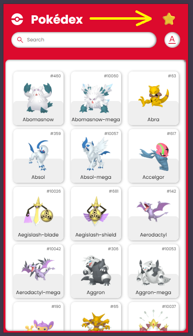
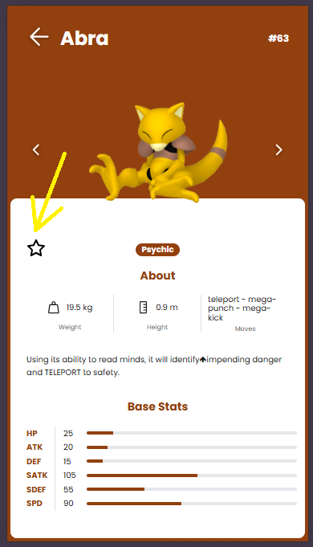
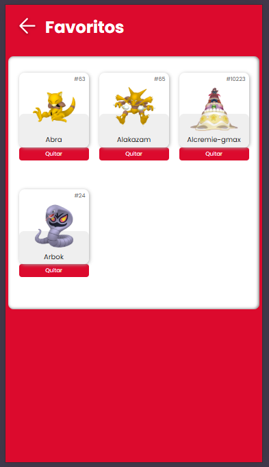

# Pokedex GraphQL Frontend

**Pokedex GraphQL** es una aplicación frontend desarrollada con **ReactJS**, **Apollo client** y **React Router DOM** que permite explorar el listado de Pokémon, visualizar sus estadísticas detalladas y gestionar una lista de favoritos de forma intuitiva.

---

## Características principales

### Visualización de la lista de Pokémon

- Visualización de un listado completo de Pokémon
- Búsqueda por **nombre** o **ID**
- Ordenamiento ascendente por **nombre** o **ID**

### Visualización del detalle de un Pokémon

- Visualización de información detallada y estadísticas del Pokémon
- Opción para agregar o eliminar un Pokémon de la lista de favoritos
- Navegación entre Pokémon mediante botones de anterior y siguiente

### Lista de favoritos

- Gestión de una lista de Pokémon favoritos
- Persistencia de favoritos utilizando localStorage

## 🛠️ Construido con

- ReactJS
- GraphQL
- Apollo Client
- React Router DOM
- LocalStorage

## ✅ Prerrequisitos

Antes de comenzar, asegúrate de tener instalado lo siguiente:

- ✅ [*Git*](https://git-scm.com/)

## 📥 Obtener el proyecto

Clona el repositorio:

```bash
#Clona el repositorio
git clone https://github.com/jeisonrojasm/pokedex-graphql-titamedia.git
cd pokedex-graphql-titamedia
```

## 🎨 Consideraciones de diseño y responsive

El diseño de la aplicación fue implementado siguiendo un enfoque **mobile-first**, basado exclusivamente en los mockups proporcionados en Figma, los cuales estaban definidos únicamente para dispositivos móviles.

No se entregaron diseños específicos para tablet o escritorio, por lo que no se desarrollaron layouts adicionales para dichos breakpoints, con el objetivo de respetar fielmente el alcance del diseño suministrado en la prueba técnica.

## 🌐 Visualización de la aplicación en Netlify

La aplicación se encuentra desplegada en **producción** y puede visualizarse a través del siguiente enlace:

🔗 <https://pokedex-graphql-titamedia.netlify.app/>

## 🚀 Ejecutar

### 1. **Archivo `.env` requerido**

Normalmente, el archivo `.env` **no debería incluirse** en un repositorio público, ya que puede contener valores de configuración sensibles.  
Sin embargo, con fines de demostración y evaluación —y dado que este no es un proyecto de producción— el archivo `.env` está incluido en el repositorio para que cualquiera pueda ejecutar el proyecto sin configuraciones adicionales.

El archivo `.env` ya se encuentra ubicado en la raíz del proyecto.

El archivo `.env` contiene la URL del endpoint GraphQL utilizado por Apollo Client.

### 2. 📝 Scripts npm disponibles

- `npm install` → Instala las dependencias del proyecto
- `npm run dev` → Ejecuta la aplicación en modo desarrollo
- `npm run build` → Genera la versión de producción

## 🔗 Fuente de datos

La aplicación consume datos desde una API GraphQL pública de Pokémon, utilizada mediante Apollo Client.

## 📁 Detalles adicionales de la aplicación

### 1. Sección de favoritos

En la parte superior derecha de la vista principal se añadió un icono el cual redirige a la vista de los Pokémon que han sido seleccionado como favoritos.



### 2. Agregar/Quitar un Pokémon de Favoritos

En la vista de detalle de un Pokémon se añadió un icono para poder añadir/quitar un Pokémon de la lista de favoritos.



### 3. Quitar Pokémon de favoritos

En la vista de favoritos se pueden visualizar los Pokémon marcados como favoritos, pero también se pueden eliminar de dicha lista



## 👨‍💻 Autor

Desarrollado por **Jeison Rojas Mora** - *Fullstack Developer*

- [https://github.com/jeisonrojasm](https://github.com/jeisonrojasm)
- [https://www.linkedin.com/in/jeison-rojas-mora/](https://www.linkedin.com/in/jeison-rojas-mora/)
